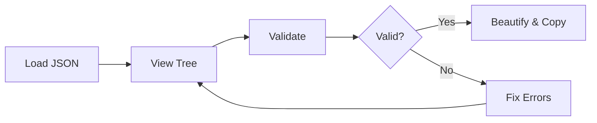

## Overview

Get started with JSON Viewer AI in seconds. This online tool lets you view, validate, and beautify JSON data without any installation. Paste or upload your JSON, explore the tree view, and catch errors instantly.

<Callout kind="info">
No account or installation required. Access it from any modern browser.
</Callout>

## Access the Tool

Visit [https://jsonviewer.ai](https://jsonviewer.ai) to open the interface immediately. The page loads a clean editor ready for your data.

## Load Your First JSON

Choose to paste JSON directly or upload a file.

<Tabs>
  <Tab title="Paste JSON" icon="clipboard">
    Copy any JSON data and paste it into the editor.

````json
{
  "user": {
    "id": 123,
    "name": "Jane Smith",
    "email": "jane@example.com",
    "preferences": {
      "theme": "dark",
      "notifications": true
    }
  },
  "orders": [
    {
      "id": 456,
      "item": "Laptop",
      "price": 999.99
    }
  ]
}
````
  </Tab>
  <Tab title="Upload File" icon="upload">
    Click the upload button, select a `.json` file from your device, and load it automatically.
  </Tab>
</Tabs>

## Navigate the Interface

The interface features a split view: editor on the left, tree visualization on the right.

<Columns cols={2}>
  <Card title="Tree View" icon="activity" href="#tree-view">
    Expand and collapse nested objects. Click nodes to highlight corresponding code.
  </Card>
  <Card title="Beautify" icon="wand-2" href="#beautify">
    Auto-format messy JSON with one click for improved readability.
  </Card>
  <Card title="Search" icon="search" href="#search">
    Find keys or values across large structures instantly.
  </Card>
  <Card title="Copy" icon="copy" href="#copy">
    Export formatted JSON or share via link.
  </Card>
</Columns>

## Perform Your First Validation

Validate JSON to detect syntax errors.

<Steps>
  <Step title="Paste or Load JSON" icon="download">
    Use the example above or your own data.
  </Step>
  <Step title="Click Validate" icon="check-circle">
    Hit the Validate button. Green checkmark for valid JSON.
  </Step>
  <Step title="Review Errors" icon="alert-triangle">
    For invalid JSON, errors highlight in red with line numbers.
  </Step>
</Steps>

<CodeGroup tabs="Valid,Invalid">
  ```json
  {
    "api": {
      "version": "1.0",
      "endpoints": ["/users", "/posts"]
    }
  }
  ```
  ````json
  {
    "api": {
      "version": "1.0"
      "endpoints": ["/users" "/posts"]  // Missing comma
    }
  }
  ````
</CodeGroup>

<Callout kind="success">
Validation completes in `<100ms`. Fix errors and re-validate instantly.
</Callout>

## Next Steps

Master core features next.

<Columns cols={3}>
  <Card title="Advanced Beautify" icon="magic" href="/features">
    Customize indentation and quoting styles.
  </Card>
  <Card title="API Integration" icon="plug" href="/integration">
    Embed JSON Viewer in your apps.
  </Card>
  <Card title="Troubleshooting" icon="help-circle" href="/troubleshooting">
    Common issues and solutions.
  </Card>
</Columns>

